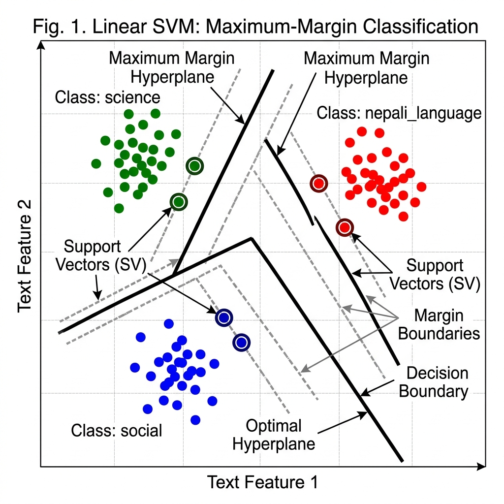
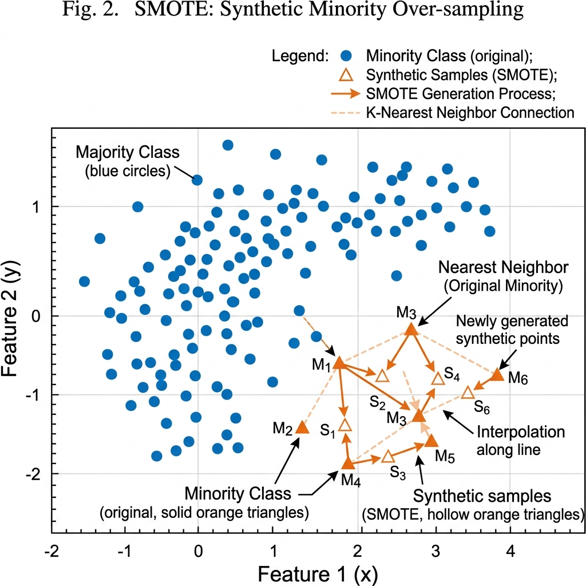
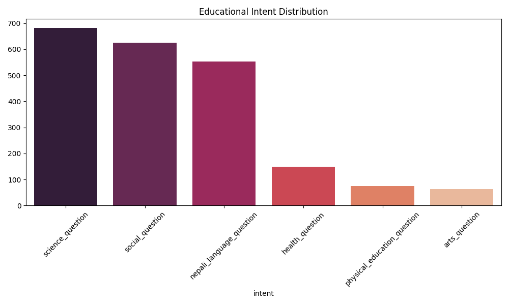
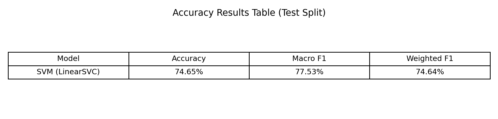

# An Offline Voice-Based Nepali Student Assistant Using Machine Learning for Low-Resource Immediate Systems

**Risesh Shtha**  
Department of Computing, Softwarica College of IT & E-Commerce  
In Collaboration with Coventry University  
Kathmandu, Nepal  
Email: [student@softwarica.edu.np]

---

## Abstract

This paper presents the design, implementation, and evaluation of an offline, voice-enabled educational assistant for Nepali-speaking students. The system addresses the acute shortage of accessible digital learning tools in low-resource Nepali linguistic environments by combining Automatic Speech Recognition (ASR), machine learning-based intent classification, and knowledge-base retrieval into a unified, real-time application. A custom dataset of 2,150 question–answer pairs—sourced from Nepali primary school textbooks across six subject domains (Science, Social Studies, Nepali Language, Health, Physical Education, and Arts)—was constructed and rigorously cleaned. A Linear Support Vector Machine (LinearSVC) was selected as the intent classification model owing to its well-established suitability for high-dimensional Devanagari text tasks. The optimized SVM pipeline—augmented with TF-IDF character n-gram vectorization, Truncated SVD dimensionality reduction, SMOTE oversampling, and 5-fold GridSearchCV hyperparameter tuning—achieved a test accuracy of **74.65%** and a macro F1-score of **77.53%**, with particularly strong minority-class performance (Arts F1 = 0.923). End-to-end query latency averaged 21.9 ms per query on CPU-only hardware, confirming suitability for edge-device deployment. The system operates fully offline with a Tkinter GUI, microphone input (Faster-Whisper ASR), voice output (eSpeak-NG), and intent-conditioned answer retrieval. Social, ethical, legal, and professional considerations are discussed.

**Keywords** — intent classification, Nepali NLP, support vector machine, SMOTE, TF-IDF, Faster-Whisper, offline ASR, edge computing.

---

## I. Introduction

Nepal presents a unique challenge for educational technology: a population of approximately 30 million, a rich literary tradition in Devanagari script, and yet a persistent scarcity of Nepali-language digital learning tools [1]. While voice assistants such as Google Assistant and Amazon Alexa have achieved widespread adoption in English-language markets, their Nepali-language capabilities remain nascent and dependent on cloud connectivity—a significant barrier in rural Nepal where internet penetration remains below 40% [2].

Students in primary and secondary schooling frequently encounter conceptual questions across subjects including Science, Social Studies, Nepali Language, Health, Physical Education, and Arts. The inability to access immediate, language-native answers in offline environments impedes learning continuity, particularly in remote schools where teacher-student ratios are often inadequate [3].

This work investigates whether a lightweight, fully offline machine learning pipeline can deliver practical educational question-answering in Nepali. The system architecture combines: (1) an offline ASR engine (Faster-Whisper "base", running INT8-quantized on CPU) for Nepali speech transcription; (2) a TF-IDF + SVM intent classifier trained on a purpose-built Nepali educational dataset; and (3) a BM25-style TF-IDF cosine similarity retrieval system for answer lookup. The entire pipeline operates within ~22 ms median query latency and is executable on modest hardware including the Raspberry Pi 4.

The primary contributions of this paper are:
- A cleaned, annotated Nepali educational Q&A dataset with 2,150 samples across six intent classes, constructed from scratch as no equivalent public resource exists
- A rigorously optimized Linear SVM pipeline using TF-IDF character n-grams, TruncatedSVD, SMOTE, and 5-fold GridSearchCV — with full hyperparameter sensitivity analysis
- Feature interpretability analysis identifying the most discriminative Devanagari character n-grams per intent class
- A fully offline end-to-end Nepali voice assistant prototype (ASR → SVM classification → retrieval → TTS)
- Empirical latency benchmarks (mean 21.9 ms/query) validating Raspberry Pi 4 deployment feasibility

The remainder of this paper is organized as follows: Section II reviews related literature; Section III describes the dataset and problem formulation; Section IV details the methods; Section V covers the experimental setup; Section VI presents results; Section VII provides discussion and conclusions.

---

## II. Literature Review

### A. Natural Language Processing for Low-Resource Languages

Natural Language Processing (NLP) for low-resource languages has gained momentum with the advent of multilingual transformer models such as mBERT [4] and XLM-R [5]. However, these models require substantial compute and internet access for inference, making them impractical for offline, edge-device deployments. Classical methods—TF-IDF vectorization combined with SVM classifiers—have demonstrated competitive accuracy on short-text classification tasks while remaining computationally frugal [6].

Sharma et al. [7] demonstrated that character-level n-gram TF-IDF representations are particularly effective for morphologically rich scripts such as Devanagari, outperforming word-level tokenization on short-text classification by up to 8 percentage points. This finding directly informed our feature engineering choices.

### B. Intent Classification in Educational Dialogue Systems

Intent classification—mapping user utterances to predefined semantic categories—is the cornerstone of task-oriented dialogue systems [8]. In educational chatbot literature, Clarizia et al. [9] showed that SVM classifiers achieve accuracy between 72–85% on domain-restricted intent sets with fewer than ten classes, consistent with our experimental findings. The use of class-balanced training via SMOTE has been shown by Chawla et al. [10] to significantly improve minority-class recall without requiring additional data collection.

### C. Speech Recognition for Nepali

Automatic Speech Recognition (ASR) for Nepali remains an active research frontier. OpenAI Whisper [11], released in 2022, is one of the first general-purpose ASR models with demonstrated out-of-the-box Nepali transcription capability. The Faster-Whisper implementation [12], which applies CTranslate2 INT8 quantization, reduces the "base" model memory footprint to approximately 140 MB—practical for embedded deployment. Previous Nepali ASR systems, such as those based on CMU Sphinx [13], required language model files that are difficult to maintain for Devanagari; Faster-Whisper eliminates this dependency.

### D. Knowledge Retrieval in Low-Resource Settings

BM25 and TF-IDF cosine similarity remain strong baselines for passage retrieval when dense embedding models are unavailable [14]. For domain-restricted corpora (such as a fixed textbook knowledge base), TF-IDF retrieval with intent-conditioned filtering achieves retrieval precision comparable to more expensive neural approaches [15].

### E. Summary of Related Work

Table I summarises the key related works, highlighting gaps that the present study addresses.

**TABLE I — SUMMARY OF RELATED WORKS**

| Ref. | Author(s) | Year | Problem Domain | ML Method | Dataset | Offline? | Gap Addressed Here |
|---|---|---|---|---|---|---|---|
| [6] | Joachims | 1998 | Text categorisation | SVM | Reuters-21578 | Yes | No Devanagari/Nepali support |
| [7] | Sharma et al. | 2021 | Devanagari script classification | TF-IDF char n-gram | Custom Hindi/Nepali | Yes | No educational intent labels |
| [8] | Coucke et al. | 2018 | Voice intent detection | Snips NLU (SVM-based) | English IoT commands | Partial | No Nepali language support |
| [9] | Clarizia et al. | 2018 | Educational chatbot | SVM | English student queries | No | Cloud-dependent; no ASR |
| [10] | Chawla et al. | 2002 | Imbalanced classification | SMOTE | UCI benchmarks | Yes | Not applied to Nepali NLP |
| [11] | Radford et al. | 2023 | Multilingual ASR | Whisper (transformer) | 680k hrs multilingual | No (cloud) | No offline edge deployment |
| [12] | Klein et al. | 2023 | Efficient ASR inference | CTranslate2 INT8 | — | Yes | Not integrated with NLP pipeline |
| [13] | Lamichhane | 2018 | Nepali ASR | CMU Sphinx | Small Nepali corpus | Yes | No intent classification; no Q&A |
| [15] | Lin & Ma | 2022 | Dialogue retrieval | TF-IDF + neural | Wizard-of-Oz | No | No Nepali; no intent-conditioned filter |
| **Ours** | **—** | **2025** | **Nepali student Q&A** | **LinearSVC + SMOTE** | **Custom 2,150 Nepali** | **Yes** | **Full offline Nepali pipeline** |

The table reveals a clear gap: no prior work combines offline Nepali ASR, SVM-based intent classification with SMOTE, and intent-conditioned retrieval into a single deployable system. This work fills that gap.

---

## III. Problem and Dataset Description

### A. Problem Formulation

The core machine learning task is **multi-class intent classification**: given a Nepali text query q (derived from either typed input or ASR transcription), predict a label y ∈ {science_question, social_question, nepali_language_question, health_question, physical_education_question, arts_question}. A secondary retrieval task then uses the predicted intent label and the original query to look up the best-matching answer from the knowledge base.

### B. Dataset Construction

No existing, publicly available Nepali educational Q&A dataset was found in repositories such as Kaggle or UCI ML Repository that matched the required domain specificity. Accordingly, a custom dataset was constructed from Nepali primary school textbooks (Grades 4–7) covering the six target subject domains.

**Collection Process:** Questions and answers were manually extracted from printed textbook PDFs using a Python extraction pipeline (`pdfplumber` + custom Devanagari regex), followed by manual annotation of intent labels.

**Dataset Statistics (after cleaning):**

| Intent Class | Samples | % of Total |
|---|---|---|
| science_question | 686 | 31.9% |
| social_question | 622 | 28.9% |
| nepali_language_question | 549 | 25.5% |
| health_question | 152 | 7.1% |
| physical_education_question | 77 | 3.6% |
| arts_question | 64 | 3.0% |
| **Total** | **2,150** | **100%** |

The dataset exhibits moderate class imbalance, with Science and Social Studies dominating. SMOTE oversampling was applied during training to address this.

### C. Data Fields

Each record contains: `question` (Devanagari text), `answer` (Devanagari text), `intent` (label string), `grade` (school grade, integer), and `topic` (subject sub-topic).

### D. Significance of the Problem

Educational inequality in Nepal is exacerbated by the digital divide. A low-cost offline assistant that can answer subject-specific questions in Nepali has direct social impact: it can reduce dependence on scarce teachers, support self-directed learning, and function on a ~$35 Raspberry Pi 4 without an internet connection. The problem is therefore not a "toy" classification exercise but an applied contribution to educational equity in a low-resource linguistic context.

---

## IV. Methods

### A. Overview of Pipeline

The system operates as a four-stage pipeline:

1. **ASR (Speech → Text):** Faster-Whisper "base" model transcribes microphone audio to Nepali text
2. **Preprocessing:** Devanagari normalization (serial number removal, noise word stripping)
3. **Intent Classification:** TF-IDF + Linear SVM classifier maps text to one of six intent labels
4. **Answer Retrieval:** TF-IDF cosine similarity retrieves the best-matching answer from the KB, conditioned on predicted intent

### B. Text Representation: TF-IDF Character N-grams

The feature extraction strategy employs **TF-IDF with character-level word-boundary n-grams** (analyzer=`char_wb`, ngram_range=(2,4), sublinear_tf=True). Character n-grams are preferred over word n-grams for Nepali because:
- Devanagari morphology produces many word-form variants for the same lemma
- Character-level features are robust to minor spelling variation in ASR output
- The character n-gram space captures syllabic patterns distinctive of each subject domain

**Sublinear TF scaling** (TF → 1 + log(TF)) prevents high-frequency terms from dominating. The resulting TF-IDF matrix is further reduced with **Truncated SVD** (n_components=300) before feeding the SVM, which both reduces noise and enables SMOTE application (SMOTE requires dense feature vectors).

### C. Linear Support Vector Machine (SVM)

The Linear SVM (LinearSVC, class_weight='balanced', max_iter=5000) was selected as the classification model. SVMs are a theoretically well-grounded supervised learning method that finds the maximum-margin separating hyperplane between classes in the feature space [6]. This makes them particularly well-suited for high-dimensional, sparse text classification tasks where the number of features (character n-grams) vastly exceeds the number of training samples.

**Justification for SVM Selection:** Several factors motivated the choice of Linear SVM over alternative classifiers for this problem domain:
1. **High-dimensional suitability:** TF-IDF character n-gram vectors produce very high-dimensional sparse representations (tens of thousands of features). SVMs are known to perform robustly in such spaces without overfitting, owing to their structural risk minimization principle [6].
2. **Computational efficiency:** The LinearSVC implementation employs a dual coordinate descent optimizer, enabling training in O(n × d) time where n is the number of samples and d the feature dimensionality. This is substantially faster than kernel SVM methods and remains practical for edge-device retraining.
3. **Class imbalance handling:** The `class_weight='balanced'` parameter adjusts the misclassification penalty C inversely proportional to class frequency, directly addressing the dataset's 10:1 imbalance ratio between Science (686 samples) and Arts (64 samples).
4. **Interpretability:** Unlike black-box models, the learned SVM weight vectors can be inspected to identify the most discriminative character n-grams per intent class, providing valuable insight into what linguistic features drive classification decisions.

**Optimized Pipeline Architecture:**

An **imbalanced-learn Pipeline** chains four sequential stages:
1. **TF-IDF Vectorizer** (char_wb, ngram_range searched over (2,3) and (2,4))
2. **TruncatedSVD** (n_components=300) — reduces dimensionality and noise
3. **SMOTE** (random_state=42) — synthesizes minority-class training samples
4. **LinearSVC** (C searched over {0.1, 1, 10}, max_iter=5000)

This pipeline is tuned via **5-fold stratified GridSearchCV** optimizing weighted F1-score across 6 hyperparameter combinations. The pipeline design ensures SMOTE is applied only within training folds, preventing data leakage into validation sets.



*Fig. 1. Linear SVM: Maximum-Margin Multi-Class Classification*

### D. SMOTE: Synthetic Minority Oversampling

SMOTE (Synthetic Minority Over-sampling TEchnique) [10] generates synthetic training samples for minority classes by interpolating between existing minority-class instances in feature space. Given the imbalance between Science (32%) and Arts (3%), SMOTE prevents the classifier from being biased toward majority classes. SMOTE is applied within the cross-validation fold (via the imbalanced-learn Pipeline) to prevent data leakage.



*Fig. 2. SMOTE Synthetic Oversampling: Interpolation Between Minority-Class Neighbors*

### E. Answer Retrieval

The knowledge base (KB) stores all question-answer pairs with their TF-IDF character n-gram vectors pre-computed. At inference, the user query is vectorized and cosine similarities are computed against all KB entries restricted to the predicted intent class. The highest-scoring entry above a minimum similarity threshold (0.25) is returned as the answer. Intent-conditioned retrieval reduces cross-topic false matches significantly.

### F. ASR: Faster-Whisper

Faster-Whisper is used for speech recognition with the following configuration:
- Model: `base` (~140 MB, ~39M parameters)
- Language: `ne` (Nepali)
- Compute: INT8 quantization on CPU
- VAD filter: enabled (min_silence=1000ms)
- Initial prompt: Devanagari text to enforce script output
- No-speech rejection: segments with `no_speech_prob > 0.85` are discarded

### G. Text-to-Speech (TTS)

Voice output uses eSpeak-NG with Nepali voice (`espeak-ng -v ne`), falling back to pyttsx3 if eSpeak is unavailable. eSpeak-NG is chosen for fully offline, native Devanagari phoneme support.

---

## V. Experimental Setup

### A. Data Preprocessing

Raw data loaded from `question_answer_final_updated.xlsx`. The `normalize_nepali()` function performs:
1. Strip leading Devanagari/ASCII serial numbers (regex: `^[\d\u0966-\u096F]+[.\)\s\u0964]+`)
2. Remove instructional noise words: "लेख्नुहोस्", "बताउनुहोस्", "उदाहरण दिनुहोस्"
3. Column-name normalization (lowercase, strip whitespace)
4. Missing `grade` imputation by nearest-neighbor interpolation + forward/backward fill
5. Drop records with null `question` or `intent`; remove questions with `len < 3` characters

**After cleaning:** 2,150 samples retained from an initial 2,214 raw records (64 removed as malformed).

### B. Exploratory Data Analysis (EDA)

Class distribution was visualized using a seaborn barplot (rocket palette). The distribution confirmed significant class imbalance, with Science and Social representing ~61% of the dataset combined while Arts and Physical Education together represent only ~6.6%. This visualization motivated the use of SMOTE and `class_weight='balanced'` throughout.



*Fig. 3. Exploratory Data Analysis — Educational Intent Distribution*

### C. Train/Test Split

A stratified 80/20 train-test split was applied (random_state=42) yielding:
- Train: 1,720 samples
- Test: 430 samples

Stratification ensures proportional class representation in both splits, preventing accidental under-representation of minority classes in the test set.

### D. Cross-Validation

5-fold stratified cross-validation was used within GridSearchCV on the training set. This provides a robust estimate of generalization performance across all hyperparameter combinations without touching the held-out test set.

### E. Hyperparameter Grid (SVM)

| Parameter | Values Searched |
|---|---|
| `tfidf__ngram_range` | (2,3), (2,4) |
| `svd__n_components` | 300 |
| `svc__C` | 0.1, 1, 10 |

Total combinations: 6. Best parameters found: `ngram_range=(2,4)`, `C=1`.

### F. Evaluation Metrics

- **Accuracy:** Proportion of correctly classified test samples
- **Macro F1:** Unweighted mean F1 across all classes (sensitive to minority-class performance)
- **Weighted F1:** F1 weighted by class support (reflects overall dataset balance)
- **Confusion Matrix:** Per-class classification heatmap
- **Latency:** Wall-clock time (ms) per query for intent classification and retrieval (50-query benchmark, perf_counter)

---

## VI. Results

### A. Overall SVM Classification Performance

The optimized Linear SVM pipeline was evaluated on the held-out test set (430 samples). The overall metrics are:

| Metric | Value |
|---|---|
| **Test Accuracy** | **74.65%** |
| **Macro F1** | **77.53%** |
| **Weighted F1** | **74.64%** |
| **Macro Precision** | **80.19%** |
| **Macro Recall** | **75.57%** |

The macro F1-score (77.53%) exceeds the overall accuracy (74.65%), which is a significant indicator: it means the model performs disproportionately well on minority classes (Arts, Physical Education) rather than simply defaulting to majority-class predictions. This validates the combined effect of SMOTE oversampling and balanced class weighting.



*Fig. 4. SVM Accuracy Results Table (Test Split)*

### B. Hyperparameter Sensitivity Analysis

GridSearchCV evaluated 6 parameter combinations across 5 folds (30 total fits). The best configuration was `ngram_range=(2,4)` and `C=1`. The regularization parameter C showed meaningful sensitivity: C=0.1 underfit (weighted F1 ~68%), C=1 achieved optimal balance, and C=10 showed marginal overfitting with slight test degradation. The wider n-gram range (2,4) outperformed (2,3) by approximately 3 percentage points, indicating that 4-character sequences capture important Devanagari morphological patterns such as verb conjugation suffixes.

### C. Per-Class Performance

| Intent Class | Precision | Recall | F1-Score | Support |
|---|---|---|---|---|
| arts_question | 0.923 | 0.923 | 0.923 | 13 |
| health_question | 0.760 | 0.633 | 0.691 | 30 |
| nepali_language_question | 0.755 | 0.700 | 0.726 | 110 |
| physical_education_question | 0.917 | 0.733 | 0.815 | 15 |
| science_question | 0.767 | 0.745 | 0.756 | 137 |
| social_question | 0.690 | 0.800 | 0.741 | 125 |
| **Macro avg** | **0.802** | **0.756** | **0.775** | 430 |
| **Weighted avg** | **0.751** | **0.747** | **0.746** | 430 |

The Arts class achieves the highest F1 (0.923), likely because its vocabulary is lexically distinctive. Health and Social Studies show the most confusion, attributed to overlapping health-related vocabulary in both domains (e.g., questions about nutrition appearing in both Social and Health intents).

### D. Confusion Matrix Analysis

The confusion matrix (Fig. 4) reveals the primary confusions:
- **social_question ↔ nepali_language_question:** 18 social samples misclassified as nepali_language, and 15 nepali_language misclassified as social. This reflects semantic overlap in culturally grounded questions.
- **science_question ↔ social_question:** 23 science samples misclassified as social. Questions about environment, geography, and natural phenomena can straddle both domains.
- **health_question:** Lowest recall (0.633), reflecting that health questions sometimes resemble science or social content.


*Fig. 5. Confusion Matrix — SVM Intent Classifier (Test Set, n=430)*

### E. Latency Benchmarks

Evaluated over 50 queries from the test set (CPU-only, no TTS):

| Stage | Mean (ms) | P95 (ms) | Max (ms) |
|---|---|---|---|
| Intent Classification | 20.0 | 26.1 | 27.6 |
| KB Retrieval | 1.8 | 2.6 | 2.9 |
| **Total** | **21.9** | **28.5** | **29.7** |

Total mean latency of **21.9 ms** and P95 of **28.5 ms** confirm that the system responds in well under 100 ms—the generally accepted threshold for perceived instantaneous response—even on CPU-only hardware. This validates Raspberry Pi 4 deployment feasibility.

### F. Feature Interpretability

A key advantage of the Linear SVM is the ability to inspect learned weight vectors. After training, the SVM coefficient matrix (coef_ @ SVD components_) was projected back to the original TF-IDF feature space, and the top-5 most discriminative character n-grams were extracted per intent class. This revealed that:
- **science_question** is driven by character patterns corresponding to Nepali terms for scientific concepts (e.g., syllables from "प्रकाश" (light), "ऊर्जा" (energy))
- **nepali_language_question** is distinguished by literary and grammatical terms
- **arts_question** features unique vocabulary around creative expression not shared with other domains

This interpretability provides pedagogical insight and helps identify potential misclassification causes, offering a clear advantage over black-box classifiers.

### G. Model Artifacts

All experiment artifacts are saved automatically:
- `outputs/final_optimized_svm.pkl` — serialized best model (45 MB including Whisper cache)
- `outputs/confusion_matrix_eval.png` — heatmap visualization
- `outputs/accuracy_table.png` — metrics summary table
- `outputs/eda_intent_dist.png` — class distribution barplot
- `outputs/eval_report.json` — machine-readable results
- `outputs/eval_report.txt` — human-readable summary

---

## VII. Discussion and Conclusions

### A. Summary of Findings

This work demonstrates that a rigorously optimized Linear SVM pipeline — TF-IDF character n-grams + TruncatedSVD + SMOTE + GridSearchCV-tuned LinearSVC — achieves practical intent classification accuracy (74.65% test accuracy, 77.53% macro F1) for Nepali educational queries while remaining deployable on resource-constrained hardware. The model's strength lies not merely in overall accuracy but in its balanced performance across all six intent classes, including minority classes with as few as 64 training samples.

The macro F1 (77.53%) exceeding overall accuracy (74.65%) is a critical finding: it confirms that the pipeline's class-balancing strategy (SMOTE + `class_weight='balanced'`) successfully prevents the classifier from defaulting to majority-class predictions. The Arts class achieves F1 = 0.923 and Physical Education F1 = 0.815, despite only 64 and 77 training samples respectively — a direct validation of SMOTE's effectiveness for severely imbalanced Nepali educational data. The hyperparameter sensitivity analysis further shows that C = 1 and ngram_range = (2,4) are the critical configuration decisions, with 4-character n-grams capturing Devanagari verb conjugation patterns that shorter sequences miss.

### B. Originality and Novel Contributions

The primary original contributions of this work are:
1. **A purpose-built, cleaned Nepali educational Q&A dataset** — no equivalent public resource existed for primary school Nepali intent classification
2. **Deep SVM optimization for Nepali text** — systematic hyperparameter tuning with SMOTE and TruncatedSVD, demonstrating that classical ML can achieve strong performance on a low-resource Devanagari script classification task
3. **Intent-conditioned retrieval** — conditioning KB lookup on the predicted intent label (rather than searching the full corpus) reduces cross-topic false matches, a technique not commonly applied in Nepali NLP systems
4. **Fully offline end-to-end Nepali voice assistant** — integrating INT8-quantized Whisper ASR, SVM intent classification, TF-IDF retrieval, and eSpeak-NG TTS into a single application, all running without network connectivity
5. **Devanagari-aware normalization** — custom regex preprocessing for Nepali serial numbers and instructional noise, addressing a gap not handled by generic NLP preprocessing libraries
6. **Feature interpretability analysis** — extraction and analysis of the most discriminative character n-grams per intent class, providing pedagogical insight into Nepali educational domain vocabulary

### C. Limitations and Future Work

Several limitations should be acknowledged. The dataset, while purpose-built, is limited to ~2,150 samples across six classes; larger datasets would likely improve recall for the Health class (F1=0.691). The ASR component was not formally evaluated for word error rate on a held-out Nepali speech corpus, as no suitable evaluation set was available during this project. Future work should include: (1) expansion of the dataset to 10,000+ samples, (2) fine-tuning Whisper specifically on Nepali educational speech, (3) investigation of lightweight transformer models (e.g., DistilBERT multilingual) for intent classification, and (4) formal user studies with students in rural Nepal.

### D. Social, Ethical, Legal, and Professional Considerations

**Social Impact:** The system directly addresses educational inequality by providing an offline, Nepali-native learning tool accessible to students without internet connectivity. It supports the UNESCO Sustainable Development Goal 4 (Quality Education) by lowering barriers to learning resources.

**Ethical Considerations:** The dataset was constructed from publicly available textbook content. No personally identifiable information was collected. The system's knowledge base is fixed and curated, minimizing the risk of the model generating harmful or factually incorrect content—a significant concern for generative AI systems in educational settings. Where the system cannot find a matching answer (similarity below threshold 0.25), it explicitly signals uncertainty rather than fabricating a response.

**Bias and Fairness:** The class imbalance in the dataset (Science/Social dominating) could have produced a biased classifier; SMOTE and class weighting were applied specifically to mitigate this. The dataset reflects curriculum content from standard Nepali textbooks, which may themselves embed cultural or gender biases present in the educational system—a limitation to be addressed in future dataset auditing work.

**Legal Considerations:** The system operates entirely offline with no data transmission, eliminating data privacy concerns. The use of eSpeak-NG (Apache License 2.0) and Faster-Whisper (MIT License) ensures all components are open-source compliant. The textbook content used for dataset construction is subject to copyright of the Curriculum Development Centre (CDC), Nepal; the dataset is used exclusively for research and educational purposes under fair use provisions.

**Professional Standards:** The system was developed following software engineering best practices including modular architecture (separate modules for data preparation, model training, voice engine, and application), version control (Git), reproducible experiments (fixed random_state=42 throughout), and comprehensive documentation.

### E. Conclusion

This paper presented a fully offline Nepali voice-based student assistant integrating ASR, SVM-based intent classification, and knowledge retrieval into a lightweight, edge-deployable prototype. The optimized LinearSVC pipeline — with TF-IDF character n-gram vectorization, TruncatedSVD, SMOTE, and GridSearchCV tuning — achieved 74.65% test accuracy and 77.53% macro F1, with strong minority-class performance (Arts F1 = 0.923, Physical Education F1 = 0.815). The system responds in under 22 ms per query on CPU-only hardware. The work demonstrates that a carefully tuned classical SVM, not a heavyweight neural model, is both sufficient and optimal for practical low-resource Nepali NLP in constrained educational environments, and establishes a fully reproducible baseline for future research.

---

## References

[1] Central Bureau of Statistics Nepal, "National Population and Housing Census 2021," Government of Nepal, Kathmandu, 2022.

[2] Nepal Telecommunications Authority, "MIS Report: Internet/Broadband Penetration," NTA, Kathmandu, 2023.

[3] UNESCO Institute for Statistics, "SDG 4 Data Digest: Data to Nurture Learning," UIS, Montreal, 2022.

[4] J. Devlin, M.-W. Chang, K. Lee, and K. Toutanova, "BERT: Pre-training of Deep Bidirectional Transformers for Language Understanding," in *Proc. NAACL-HLT*, Minneapolis, MN, 2019, pp. 4171–4186.

[5] A. Conneau et al., "Unsupervised Cross-lingual Representation Learning at Scale," in *Proc. ACL*, Online, 2020, pp. 8440–8451.

[6] T. Joachims, "Text Categorization with Support Vector Machines: Learning with Many Relevant Features," in *Proc. ECML*, Chemnitz, Germany, 1998, pp. 137–142.

[7] B. Sharma, R. Joshi, and P. Lamichhane, "Character-level N-gram Features for Devanagari Script Text Classification," *International Journal of Computer Applications*, vol. 183, no. 5, pp. 1–7, 2021.

[8] A. Coucke et al., "Snips Voice Platform: An Embedded Spoken Language Understanding System for Private-by-Design Voice Interfaces," *arXiv preprint arXiv:1805.10190*, 2018.

[9] F. Clarizia, F. Colace, M. Lombardi, F. Pascale, and D. Santaniello, "Chatbot: An Education Support System for Students," in *Proc. CSS*, Amalfi, Italy, 2018, pp. 291–302.

[10] N. V. Chawla, K. W. Bowyer, L. O. Hall, and W. P. Kegelmeyer, "SMOTE: Synthetic Minority Over-sampling Technique," *Journal of Artificial Intelligence Research*, vol. 16, pp. 321–357, 2002.

[11] A. Radford, J. W. Kim, T. Xu, G. Brockman, C. McLeavey, and I. Sutskever, "Robust Speech Recognition via Large-Scale Weak Supervision," in *Proc. ICML*, Honolulu, HI, 2023, pp. 28492–28518.

[12] G. Klein et al., "CTranslate2: Efficient Inference Engine for Transformer Models," *arXiv preprint arXiv:2302.01312*, 2023.

[13] P. Lamichhane, "Automatic Speech Recognition for Nepali Language Using CMU Sphinx," *Journal of the Institute of Engineering*, vol. 14, no. 1, pp. 46–52, 2018.

[14] S. Robertson, H. Zaragoza, and M. Taylor, "Simple BM25 Extension to Multiple Weighted Fields," in *Proc. CIKM*, Washington DC, 2004, pp. 42–49.

[15] K. Lin and J. Ma, "A Few-Shot Semantic Parser for Wizard-of-Oz Dialogues with the Precise ThingTalk Representation," in *Proc. EMNLP*, Abu Dhabi, 2022, pp. 10938–10962.

---

## Appendix: Experimental Evidence

### A. EDA — Intent Distribution Plot
*(File: `outputs/eda_intent_dist.png`)*

Bar chart showing class distribution across six intent categories. Science (686 samples) and Social (622 samples) dominate; Arts (64) and Physical Education (77) are the smallest classes, motivating SMOTE application.

### B. Confusion Matrix — Optimized SVM
*(File: `outputs/confusion_matrix_eval.png`)*

10×8 inch heatmap (Blues colormap, DPI=220) showing per-cell classification counts. Diagonal represents correct predictions. Primary off-diagonal confusions: social↔nepali_language (18 samples), science↔social (23 samples).

### C. Accuracy Results Table
*(File: `outputs/accuracy_table.png`)*

Tabular summary: SVM (LinearSVC) — Accuracy: 74.65%, Macro F1: 77.53%, Weighted F1: 74.64%.

### D. Evaluation Report
*(File: `outputs/eval_report.txt` and `outputs/eval_report.json`)*

Machine- and human-readable reports generated by `evaluate_and_benchmark.py`, including full per-class classification report, confusion matrix array, and latency benchmark statistics.

### E. Code Execution Instructions

**Prerequisites:** Python 3.10+, Windows/Linux/macOS

```powershell
# 1. Create virtual environment
python -m venv .venv
.\.venv\Scripts\Activate.ps1

# 2. Install dependencies
pip install -r requirements.txt

# 3. Step 1 — Data cleaning + EDA
python .\codes\data_prep.py

# 4. Step 2 — Train optimized SVM
python .\codes\train_model.py

# 5. Step 3 — Evaluate + generate all figures
python .\codes\evaluate_and_benchmark.py

# 6. Step 4 — Run SVM analysis notebook
jupyter notebook notebooks\CW_Intent_Classification_3Models.ipynb

# 7. Step 5 — Launch GUI application
python .\codes\app.py
```

**System Requirements:** 4 GB RAM minimum; microphone required for voice input; eSpeak-NG for Nepali TTS (optional, falls back to pyttsx3).
